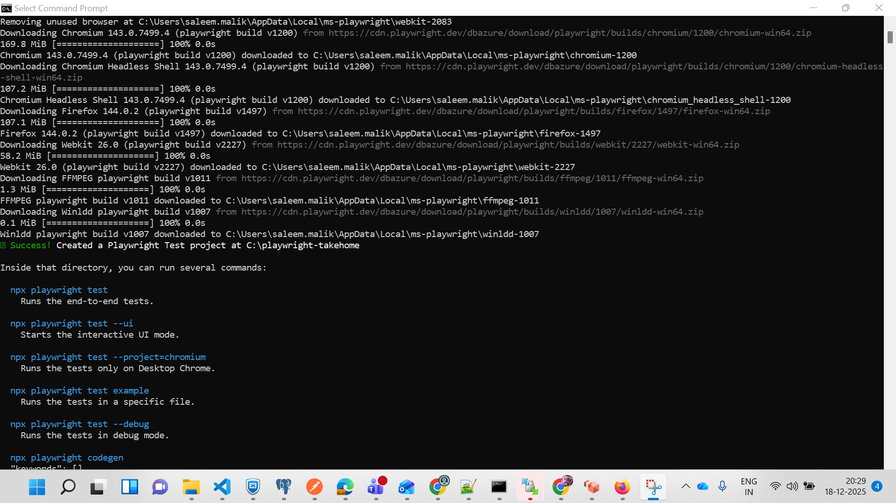
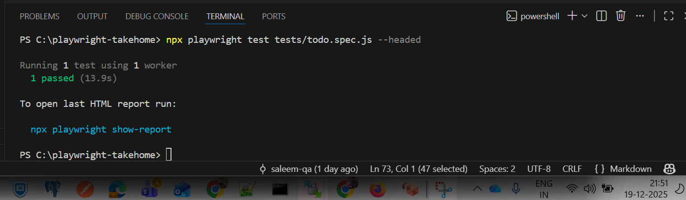
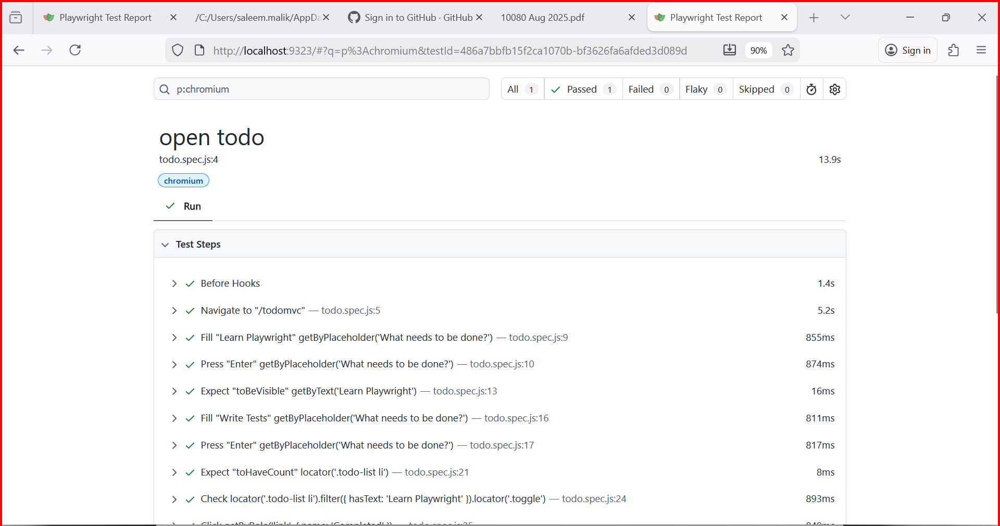

# Playwright Take-Home Assignment – Surgimate (SDET)

## Project Overview

This repository contains a Playwright-based automated UI test created as part of the **Surgimate – 2nd Round (SDET) Take-Home Assessment**.

The test validates core user flows of the **TodoMVC demo application**, including adding todos, completing items, filtering by status, and clearing completed tasks.

**Application Under Test:**
[https://demo.playwright.dev/todomvc](https://demo.playwright.dev/todomvc)

---

## Environment Details

* **Node.js Version Used:** `v20.18.0`
* **Language:** JavaScript
* **Test Framework:** `@playwright/test`
* **Package Manager:** npm
* **Browsers:** Chromium, Firefox, WebKit (Playwright defaults)

---

## Project Structure

```
playwright-takehome/
│
├── tests/
│   └── todo.spec.js
│
├── playwright.config.js
├── package.json
└── README.md
```

---

## Installation & Setup

### Prerequisites

* Node.js `v20.18.0`
* npm (bundled with Node.js)

### Install dependencies

From the project root directory, run:

```bash
npm init playwright@latest
```

This will install Playwright along with all required browser binaries.

---
## Installation Screenshot


## Test Run

### Test Run (headless mode)

```bash
npx playwright test
```
## Test-Run Screenshot


## Test Coverage Summary

The automated test performs the following actions:

* Opens the TodoMVC application
* Adds a todo: **“Learn Playwright”**
* Verifies the todo appears in the list
* Adds a second todo: **“Write tests”**
* Verifies that two todo items are present
* Marks **“Learn Playwright”** as completed
* Verifies:

  * **Completed** filter shows 1 item
  * **Active** filter shows only **“Write tests”**
* Clears completed todos and validates the updated list

Assertions are implemented using Playwright’s built-in `expect` API.

---
## Playwright Configuration Notes

For local execution and better visibility of browser actions, the following configuration was added in **playwright.config.js:**
* Slow motion (slowMo) is enabled to visually observe each browser interaction.
* Tests are executed in headed mode during local runs.
* For simplicity during this exercise, execution was limited to a single browser by commenting out other browser projects.
**Note**: Playwright supports multi-browser execution by default.
The configuration was intentionally simplified for local debugging and clarity.

## Notes & Design Decisions

* User-centric locators (`getByRole`, `getByPlaceholder`) are used for better stability.
* No hard waits are used to avoid flaky tests.
* The test represents a real user flow in a single, readable scenario.

---

## AI Usage

* **AI / Cursor Usage:** Not used
  All code and documentation were written manually.

---

## Execution Proof

### Run the Todo test in headed mode (browser visible)

```bash
npx playwright test tests/todo.spec.js --headed
```
## Todo Test Screenshot


### To see the html report

```bash
npx playwright show-report
```
## HTML Report


### Run tests using a single worker

```bash
npx playwright test tests/todo.spec.js --workers=1
```
## Single Worker Screenshot


This command was used to ensure sequential execution during local runs for easier observation and debugging.

## Conclusion

This project demonstrates:

* Correct Playwright setup
* Stable UI automation using modern Playwright APIs
* Clear documentation for setup and execution.